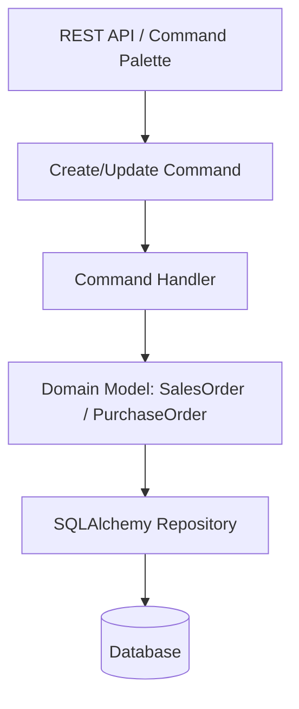
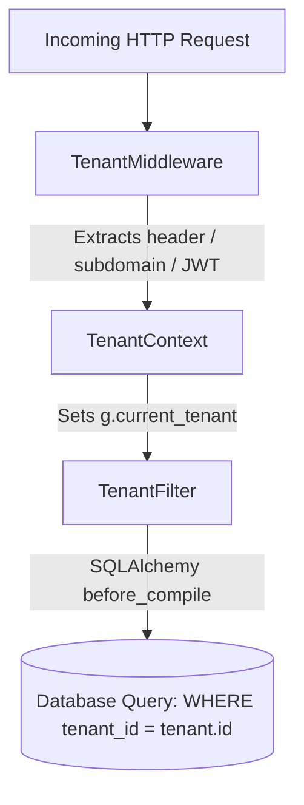

# Architettura ERPSEED Backend & Frontend

## Panoramica

ERPSEED è un sistema ERP modulare e ad alte prestazioni costruito con Flask (Backend) e React 19 + Vite + Ant Design (Frontend). Utilizza un'architettura multi-tenant con supporto per:
- Creazione dinamica di modelli dati (No-Code Builder)
- Modelli di dominio CQRS estesi (Sales, Purchases, Invoicing, Products, Projects)
- Global Command Palette (`Ctrl+K`) ed esperienza utente produttiva ad alta velocità
- Workflow automation & webhook event-driven
- AI Assistant integrato e gateway distribuito agentico (AgentMesh)

## Stack Tecnologico

| Layer | Componente | Tecnologia |
|-------|------------|-----------|
| **Backend** | Framework API | Flask 3.x + Flask-Smorest (OpenAPI 3.0) |
| | ORM | SQLAlchemy + Flask-SQLAlchemy |
| | Auth & Security | Flask-JWT-Extended (JWT) |
| | Serializzazione | Marshmallow |
| | Database | PostgreSQL 15 (dev: SQLite) |
| | Cache & Realtime | Redis 7 + Flask-SocketIO (eventlet) |
| | i18n | Flask-Babel |
| **Frontend**| UI Framework | React 19 + Vite |
| | Component Library | Ant Design (`antd`) |
| | UX & Theme Tokens | Centralized Token Layer (`frontend/src/theme/tokens.js`) |
| | Charts | `@ant-design/charts` (Standard primario) |
| | State & Hooks | React Context + Zustand + Custom Hooks (`useCommandPalette`, `useResponsive`) |
| | i18n | `react-i18next` (EN/IT) |

## Struttura del Progetto

```
backend/
├── __init__.py              # App factory (create_app)
├── extensions.py            # Inizializzazione estensioni Flask
├── schemas.py               # Schemi Marshmallow centrali
├── container.py             # Iniezione dipendenze (Container)
├── models/                  # MODELLI DATABASE (SQLAlchemy)
│   ├── sales.py             # SalesOrder, SalesOrderLine (extended fields)
│   ├── purchase.py          # PurchaseOrder, PurchaseOrderLine (extended fields)
│   └── ...                  # Modelli anagrafici, finanziari, di produzione e sistema
│
├── core/                    # CORE SYSTEM (Auth, Tenant, Middleware, Services)
├── modules/                 # MODULI APPLICATIVI (CQRS & Domain Logic)
│   ├── sales/              # Ordini Vendita & Preventivi (CQRS & Domain Dataclasses)
│   ├── purchases/          # Ordini Acquisto (CQRS & Domain Dataclasses)
│   └── ...                 # Moduli applicativi
```

## Frontend Architecture & Productive UX

### 1. Global Command Palette (`Ctrl+K` / `Cmd+K`)
Unifica l'accesso rapido a tutte le 50+ pagine applicative e gli strumenti low-code.
```
ProjectLayout → CommandPalette Modal → useCommandPalette Hook → Direct Navigation / Rapid Actions
```

### 2. Productive Keyboard Shortcuts & Mobile Card View
- **`Ctrl+S` / `Cmd+S`**: Intercetta e salva il form/modal attivo.
- **`Esc`**: Chiude immediatamente dialoghi e modal.
- **Mobile Card View**: `<GenericCrudPage />` converte automaticamente le tabelle in `<Card>` espandibili quando `useResponsive().isMobile` è attivo (`<992px`).

### 3. Document Line Editing
Componenti specializzati per la gestione di righe ordine:
- **`InlineEditableTable.jsx`**: Calcolo dinamico in tempo reale di sconti, aliquote IVA e totali.
- **`ProductLookupInput.jsx`**: Input con ricerca debounced e autocompletamento prodotti.

## Modelli di Dominio & CQRS (Sales & Purchases)

I moduli `sales` e `purchases` sono strutturati in layer CQRS trasparenti con estensione enterprise dei campi:



### Campi Enterprise Estesi:
- **Valute e Listini**: `currency_id`, `pricelist_id`, `payment_term_id`.
- **Anagrafiche e Indirizzi**: `billing_address_id`, `shipping_address_id`, `salesperson_id` / `buyer_id`, `customer_reference` / `supplier_reference`, `warehouse_id`.
- **Dettagli di Riga**: `tax_id` (IVA di riga), `discount_percent` (sconto percentuale), `uom_id` (unità di misura), `expected_delivery_date` (data prevista consegna), `landing_costs`.

## Multi-Tenancy

### Row-Level Isolation

L'isolamento dei dati multi-tenant viene gestito a livello di riga (**Row-Level Isolation**) tramite la colonna `tenant_id` presente su tutti i modelli di dominio e un filtro automatico SQLAlchemy applicato a livello di query (`before_compile`).



> **Nota di architettura**: La logica di filtraggio automatico e contesto tenant è gestita centralmente da `backend/core/services/tenant/tenant_filter.py` (`TenantContext` e `TenantFilter`). Il file `backend/core/services/query_filter.py` è **deprecato** e sostituito da quest'ultimo.

## Event System & AgentMesh Integration

L'architettura supporta l'integrazione agentica distribuita tramite `CapabilityRegistry` ed il bilanciamento eventi tramite `EventBus`.

```python
# shared/events/event_bus.py
class EventBus:
    def publish(self, event_name, data):
        for handler in self._handlers[event_name]:
            handler(data)
```

---

*Per la cronologia completa delle modifiche di questo documento, consulta la cronologia Git del repository.*

---

> Ultimo aggiornamento: 10 Settembre 2026 | [Torna all'Indice](INDEX.md)
